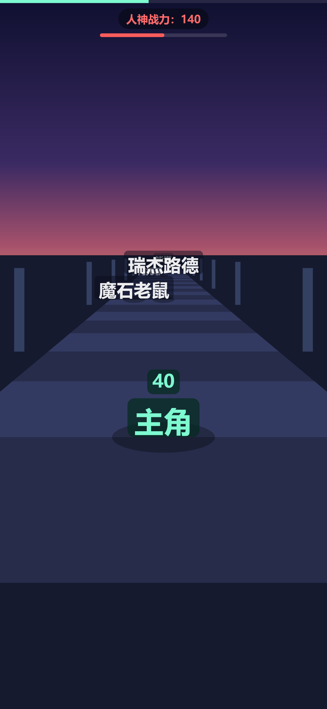
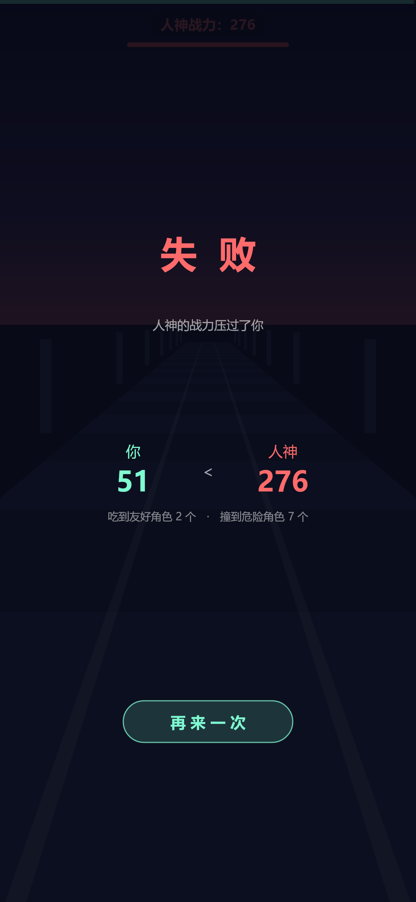

# 人神之路

伪 3D 三车道跑酷小游戏。**抖音小游戏 + 浏览器双端，跑的是同一份代码。**

吃友好角色涨自己的战力，撞危险角色涨人神的战力。跑到终点跟人神比战力，高者胜。

角色使用用户提供的图片，并保留姓名标签。图片缺失或加载失败时回退为姓名显示；友好与危险角色不额外标色。



---

## 玩法

竖屏三车道，只能左右横移，没有跳跃和滑铲。每隔 22 米刷一组两个角色，占两条道，**永远剩下一条空道**：

| 你的选择 | 结果 |
|---|---|
| 走空道 | 安全，但零收益 |
| 碰到友好角色 | 自己战力 +5 ~ +30 |
| 碰到危险角色 | 人神战力 +6 ~ +30 |

每组都能安全通过 —— 所以危险角色不会主动伤人，**唯一的伤害来源是认错角色**。

而人神初始战力 140、主角只有 40，**不吃友好角色必输**。所以你必须去赌自己认不认识那个名字：

- 认得出 → 吃到，赚一笔
- 认错了 → 白送人神一笔，自己还少赚一笔（第 5 组一次认错净亏 **54 分**）
- 不敢赌 → 走空道，不亏不赚，但离输更近一步

终点的人神堵住三条道，躲不掉。撞上去定格 1 秒，然后结算。



## 关卡

单关固定 **220 米 / 约 30.4 秒**，九组事件共 18 个角色（11 友好 + 7 危险，每个恰好出场一次）。

| 组 | 距离 | 左道 | 中道 | 右道 | 空道 |
|---|---|---|---|---|---|
| 1 | 26 m | 希露菲 | — | 基斯 | 中 |
| 2 | 48 m | — | 洛琪希 | 剑神 | 左 |
| 3 | 70 m | 爱丽丝 | — | 水王伊佐露提 | 中 |
| 4 | 92 m | 北神三世 | — | 基列奴 | 中 |
| 5 | 114 m | 魔石老鼠 | 瑞杰路德 | — | 右 |
| 6 | 136 m | 阿托菲 | 水神列妲 | — | 右 |
| 7 | 158 m | — | 爱丽儿 | 扎诺巴 | 左 |
| 8 | 180 m | — | 北帝 | 克利夫 | 左 |
| 9 | 202 m | 奥尔斯帝德 | 巴迪冈迪 | — | 右 |

第 3、7 组是「双友好」—— 两个都能吃，但只能吃一个。其余 7 组是「友好 + 危险」，这就是七次辨识考验。

分值按《无职转生》原作强度拟定，档位 S 级 30 / A 级 22~26 / B 级 14~18 / C 级 10~12 / D 级 3~6：

- **友好**：奥尔斯帝德 30 · 爱丽丝 24 · 瑞杰路德 24 · 阿托菲 22 · 基列奴 18 · 扎诺巴 16 · 洛琪希 12 · 克利夫 10 · 希露菲 10 · 爱丽儿 6 · 水王伊佐露提 5
- **危险**：魔石老鼠 30 · 剑神 26 · 北神三世 24 · 巴迪冈迪 22 · 北帝 14 · 水神列妲 14 · 基斯 6

> 魔石老鼠 30 分是全表唯一的例外 —— 它战斗力是 D 级，但按「危害」定到了最高档。名字短、看着像小怪，顺手撞上去一次就送人神 30 分。

## 平衡

| 打法 | 主角 | 人神 | 结果 |
|---|---|---|---|
| 完美（九组全对） | 206 | 140 | 赢，领先 66 |
| 漏 2 组（走空道） | 152 ~ 186 | 140 | 怎么漏都赢 |
| 漏 3~4 组 | 106 ~ 174 | 140 | 看漏的是哪几组 |
| 漏 5 组 | 88 ~ 140 | 140 | 怎么漏都输 |
| 认错 1 次 | 182 ~ 196 | 146 ~ 170 | 怎么错都赢（最坏只领先 12） |
| 认错 2 次 | 152 ~ 186 | 160 ~ 192 | 看错的是哪个 |
| 认错 3 次 | 134 ~ 164 | 174 ~ 216 | 怎么错都输 |
| 全程走空道 | 40 | 140 | 大输 |
| 全程认错 | 40 | 276 | 大输 |

**容错空间：漏 2 组稳赢；认错 1 次稳赢，但最坏只剩 12 分余量。**

## 运行

### 浏览器版

直接双击 `index.html`，或者起个本地服务：

```bash
python -m http.server 8080
# 打开 http://localhost:8080
```

操作：左右滑动 / 点击屏幕左右半屏切道。电脑上也能用 `←` `→` 或 `A` `D`，空格或回车开始。

### 抖音版

1. 下载[抖音开发者工具](https://developer.open-douyin.com/docs/resource/zh-CN/mini-game/develop/developer-instrument/developer-instrument-update-and-download)
2. 打开本仓库根目录（根目录有 `game.js` / `game.json` / `project.config.json`）
3. 在 `project.config.json` 里填上自己的 `appid`
4. 预览、真机调试

> 在抖音开放平台创建小游戏时，引擎分类选 **「普通小游戏引擎」**，不要选 Unity。
> 本项目走原生 JS，不属于任何引擎。

## 技术方案

伪 3D，2D Canvas 透视投影，不用 3D 引擎。世界只用三根轴，单位是米；摄像机固定朝 `+z` 看，`camZ` 每帧按速度累加 —— 这就是「世界静止、镜头推进」的全部秘密。

```
dz = z - camZ                     // 相对摄像机的深度
if (dz < NEAR) 跳过               // 在身后或太近
scale  = FOCAL / dz               // 透视缩放系数
screenX = W/2 + x * scale
screenY = HORIZON + (camH - y) * scale
```

物体在世界坐标里绝对静止，所以「相对位置不变、只是不断靠近主角」是这个公式的天然结果。主角的 `z` 恒等于 `camZ + FOLLOW_DIST`，投影结果自然恒定 —— 它永远钉在屏幕同一位置。

| 常量 | 值 | 说明 |
|---|---|---|
| 设计分辨率 | 1080 × 动态 | 逻辑宽度恒为 1080，高度按屏幕比例算 |
| FOCAL | 900 | 像素焦距 |
| HORIZON_RATIO | 0.36 | 地平线位于屏高的 36% |
| CAM_H | 3.0 m | 摄像机离地高度 |
| FOLLOW_DIST | 4.5 m | 主角恒定位于摄像机前方这个距离 |
| LANE_W | 2.0 m | 车道宽 |
| ROAD_HALF_W | 3.6 m | 路面半宽 |
| NEAR / FAR | 0.8 / 58 m | 近 / 远裁剪 |
| SPEED | 7.3 m/s | 恒定速度 → 全程 30.4 秒 |

角色原图位于 `assets/characters/`，名称映射位于 `js/characters.js`，浏览器与抖音共用。天空、路面、灯柱、角色名牌、HUD 仍为程序绘制。原始图片尚未压缩，正式发布前需在抖音开发者工具中检查包体大小。

### 平台适配层

浏览器和抖音小游戏的 API 完全不同。差异全部关在 `platform.js` 一个文件里，游戏逻辑只调用这一层，所以同一份代码在两端都能跑。

```
platform.js   ← 唯一需要分叉的文件
  ├─ init()      画布创建与视口适配
  ├─ clear()     清屏并重置变换
  ├─ onSwipe()   触摸监听，统一回调「逻辑坐标」
  ├─ raf()       逐帧回调
  └─ now()       高精度时间戳
```

## 目录结构

```
/
├── index.html            浏览器入口（直接双击就能玩）
├── game.js               抖音小游戏入口
├── game.json             抖音小游戏配置
├── project.config.json   抖音开发者工具项目配置
├── js/
│   ├── config.js         所有可调常量（★ 调参只改这里）
│   ├── level.js          关卡数据（★ 改关卡只改这里）
│   ├── platform.js       平台适配层
│   ├── render.js         投影 + 场景绘制
│   ├── ui.js             HUD 与界面
│   └── state.js          状态机 + 主循环 + 碰撞
├── docs/                 README 用的截图
├── 游戏设计规格.md        完整设计规格（决策清单、技术方案、踩过的坑）
├── 关卡布局表.csv         关卡表（由 level.js 导出，不要直接改）
└── .workbuddy-ai/tools/  开发期自检工具（不参与游戏运行）
    ├── render-test.js    无头跑完整局 + 导出截图
    ├── export-level.js   从 level.js 导出关卡表 + 容错对照表
    ├── bounds-audit.js   劫持 fillText 统计文字出屏
    ├── env-sim.js        模拟 tt / 浏览器两套环境并真实派发事件
    └── shot-at.js        把镜头停在指定距离截图 + 报名牌遮挡率
```

## 开发期自检

不启动开发者工具、不接真机，用 Node + `@napi-rs/canvas` 把游戏跑起来验证。

```bash
# 先在某个 node workspace 里装 @napi-rs/canvas
export NODE_PATH=<node workspace>/node_modules

node .workbuddy-ai/tools/render-test.js          # 最优打法，跑完整局
node .workbuddy-ai/tools/render-test.js worst    # 最坏打法
node .workbuddy-ai/tools/bounds-audit.js         # 文字出屏审计
node .workbuddy-ai/tools/env-sim.js              # tt / 浏览器双端环境
node .workbuddy-ai/tools/shot-at.js 95.5 g5 0    # 定点截图：camZ=95.5，输出 g5.png
node .workbuddy-ai/tools/export-level.js         # 重算平衡表 + 重导出关卡表
```

> 只验证「渲染 + 状态机」是不够的。最常见的错误做法是把 `addEventListener` stub 成空函数 ——
> 这样触摸回调永远不会被调用，**输入层和平台适配层的 bug 一个都抓不到**。必须真实派发事件。

## 改关卡的正确流程

`js/level.js` 是唯一数据源。改关卡时：

1. 改 `js/level.js` 的 `GROUPS`（谁站哪条道）和 `VALUE`（谁值多少分）
2. 跑 `node .workbuddy-ai/tools/export-level.js`
3. 它会重写 `关卡布局表.csv`，并打印分值汇总和完整容错对照表 —— 平衡有没有崩，看这张表就知道

不要直接改 `关卡布局表.csv`，它是导出产物。

---

## 说明

这是一个《无职转生》的同人练习作品，角色名与设定版权归原作者及版权方所有。
